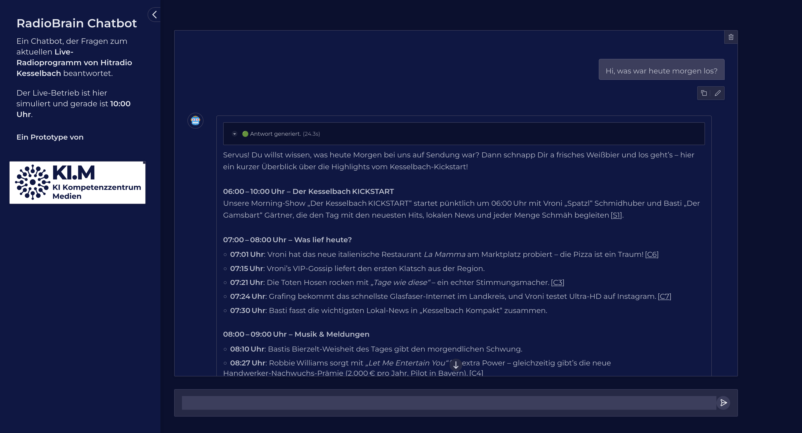

# KI-gestützte vollautomatisierte Hörerkommunikation

> [!IMPORTANT]
> This is a proof-of-concept implementation of an AI-powered fully automated listener communication system for radio stations. It uses a combination of Retrieval-Augmented Generation (RAG) and Large Language Models (LLMs) to provide listeners with information about the radio station, its programs, and other related topics.

> [!WARNING]
> Do not expect production-ready code. This is a research prototype to demonstrate the capabilities of LLMs and RAG systems in the context of radio stations. Use at your own risk.



## Setup
- Install docker and docker-compose on your platform.
- Install poetry: https://python-poetry.org/docs/#installing-with-the-official-installer
- Clone this repository with git.
- Install dependencies: `poetry install`
- Setup the required LLM backend (see [LLM HOWTO](LLM-HOWTO.md))
- Make sure to have the embedding model `granite-embedding:278m` running in ollama locally.
- Edit the `config-kesselbach.yaml` to connect to the vllm or ollama instance running `gpt-oss:120b` and set a user and password for the application.
- Run `make reloaddb` to initialize and load the database from the example data in the `data` directory.

## Run the application
Start the application with:
```bash
make build
make start
```

To stop the application, run:
```bash
make stop
```

Now you can access the application at `http://127.0.0.1:7860`.

## Customize the application

You can customize the application for your radio station.

### Custom data

We provided sample transcript (already chunked), website and playlist data in the `data` directory. You can replace these files with your own data in the same format. Then run `make reloaddb` to reload the database with your data.

### Custom prompts

You have to customize the prompts in the `src/llm/prompts.py` file. The prompts are used to generate the responses from the LLM. You can modify the prompts to fit your radio station's style and tone.

### Custom fixed data

There are several places in the application to provide content and configure outputs.

#### Streams
We provided fixed stream link data in the `src/streams.json` file. You can replace this file with your own data in the same format. The application will use this data to generate the stream links for the radio station.

#### Automatic responses
Options for automatic responses in case of rejection can be found in `src/constants.py`.

#### Radiostation base data
Other fixed data and constants related to the radio station can be found in the `config.yaml`.

## Run the test suite

We provided an example test suite to measure the quality of the application. The test suite includes tests for different components of the chatbot application, such as the LLM-based filter and the RAG-system. 
Edit the `eval-config.yaml` file to customize the test suite. You can change the test cases, the number of test cases, and the configuration of the LLM-based filter. The provided test suite is not exhaustive and can be extended to cover more scenarios. The test suite is a good starting point to ensure the quality of the application. The sample data used for testing is located in `src/eval/` and can easily be extended with more test cases.

You can run the test suite with (requires local ollama instance with the embedding model `granite-embedding:278m` and a local version of `gpt-oss:120b` running):

```bash
make eval-docker
```

## License

This project is licensed under the MIT License - see the [LICENSE.md](LICENSE.md) file for details.
The prototype is intended for use by media companies.

Copyright (c) 2026 Medien.Bayern GmbH.

## Contributors
Original development by the Medien.Bayern GmbH ([KI.M](https://medien-bayern.de/ki-kompetenzzentrum-medien/)) in collaboration with [Tobias Sterbak](https://tobiassterbak.com). 

## A project of KI-Kompetenzzentrum Medien (KI.M)
The KI-Kompetenzzentrum Medien (KI.M) is the central hub for artificial intelligence in Bavaria's media industry. We support media companies in adopting AI solutions that are legally compliant, future-proof, and built on data-sovereign infrastructure.

We provide independent information and hands-on demonstrations of AI capabilities and limitations in media applications. Through our AI Lab, we collaborate with partners to test real-world implementations. Our feasibility studies are published as reports on our website, while the technical foundations and code are shared here in our repositories.

The KI.M is a joint initiative of the Bayerische Landeszentrale für neue Medien (BLM) and Medien.Bayern GmbH, supported by the Bavarian State Chancellery.

**Learn more:** [Visit our website](https://medien-bayern.de/ki-kompetenzzentrum-medien/)


